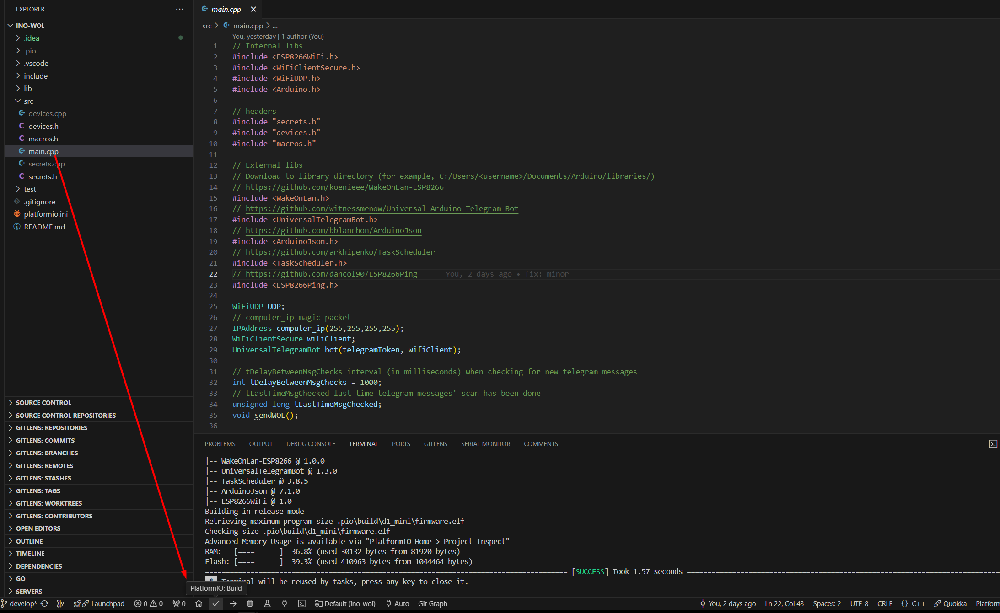
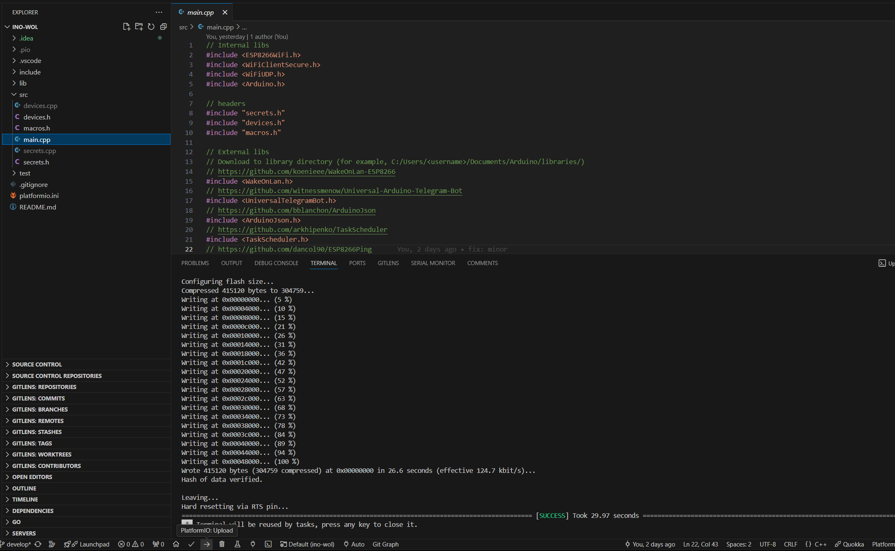
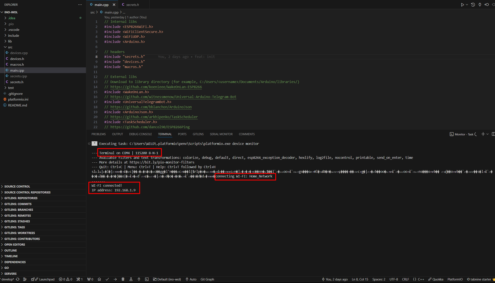
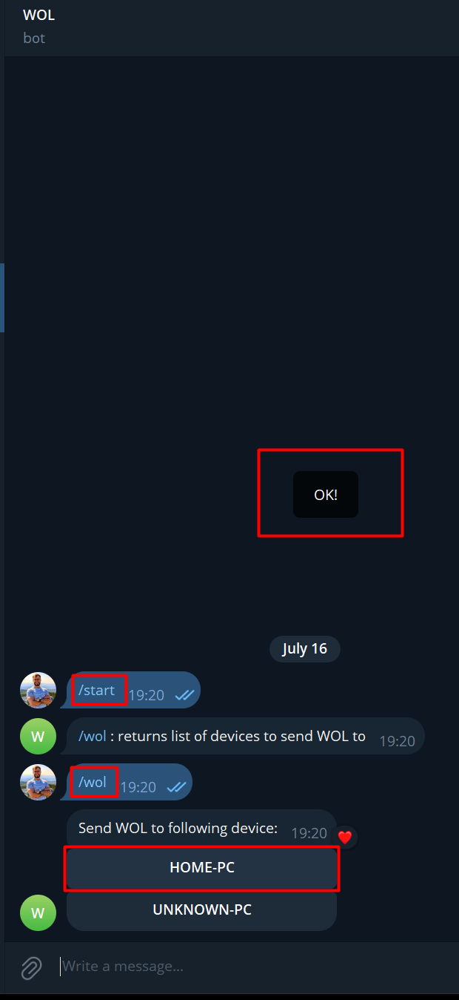

Are you tired of always having to practically crawl under your desk to turn on your PC? Or maybe you need to turn your computer on or off from another location (where there is Internet access)? Then I think this solution will interest you.

The main goal was to have access to my home PC in case I forgot something. The first thing that came to my mind was to combine an ESP8266 and a Telegram Bot for this. But how can you turn on a PC with this? For example, you could connect it to the PC's motherboard inputs for the switch. But that's too cumbersome. It turns out there's a simple solution - WOL (or wake-on-lan). WOL, as the name suggests, can "wake up" something over LAN.

For implementation, we will need:
- ESP8266;
- VSCode;
- PlatformIO;
- Telegram Bot token;
- Internet access (via Wi-Fi);

I used this model, and it's more than sufficient for this project. [Wemos D1 mini](https://aliexpress.ru/item/32705466032.html?sku_id=12000029204050485&spm=a2g2w.productlist.search_results.0.45651bfeQM9O9j).

To "flash" the code, we will use VSCode and PlatformIO. For more details on how to set it up, see the instructions [here](https://platformio.org/install/ide?install=vscode).

The source code of the project is available [here](https://github.com/WildEgor/ino-wol). There, you can also find a brief explanation of the configuration and comments on the code.

The main idea is to listen for "commands" from a Telegram Bot and send a "magic packet" to the device.



Let's compile `main.cpp`

and if there are no errors, upload it

By switching to Serial Monitoring, you can see the logs. If the board successfully connects to the internet and receives messages, you will see this:

Now you can go to the Telegram Bot and test it. Enter the previously created bot and send commands:
{: width="250" }

The use cases are not limited to this, as you can turn on any device that supports WOL. However, I use it for a personal computer in conjunction with the Parsec program for remote access.

## Links:
1. [Source code](https://github.com/WildEgor/ino-wol/blob/develop/src/main.cpp)
2. [Setting up a Telegram Bot](https://core.telegram.org/bots/tutorial)
3. [VSCode](https://code.visualstudio.com/)
4. [PlatformIO](https://platformio.org/)