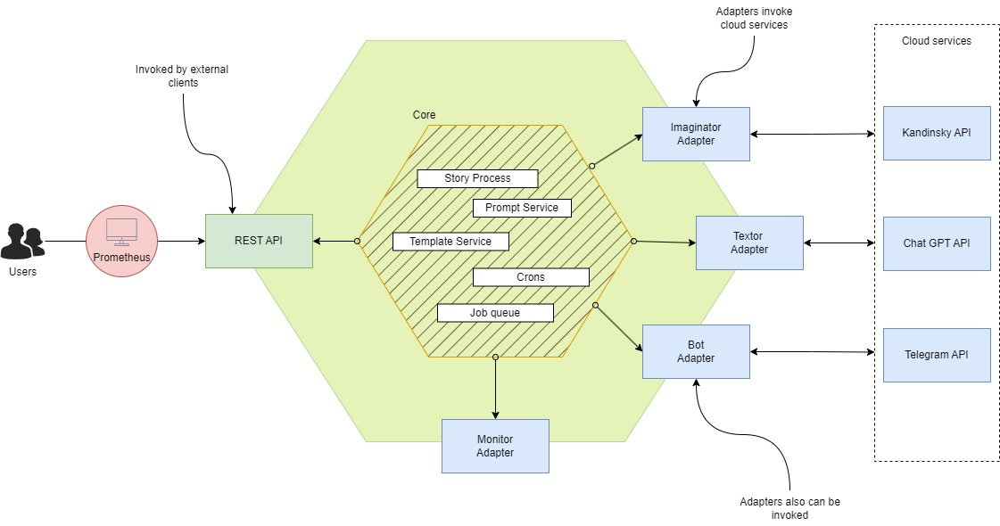
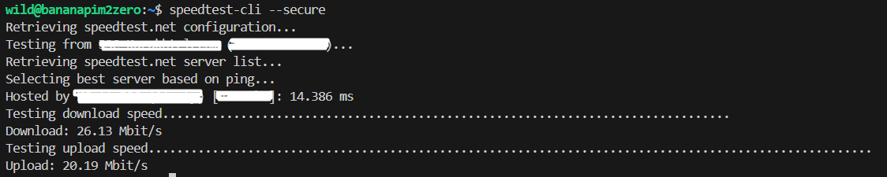
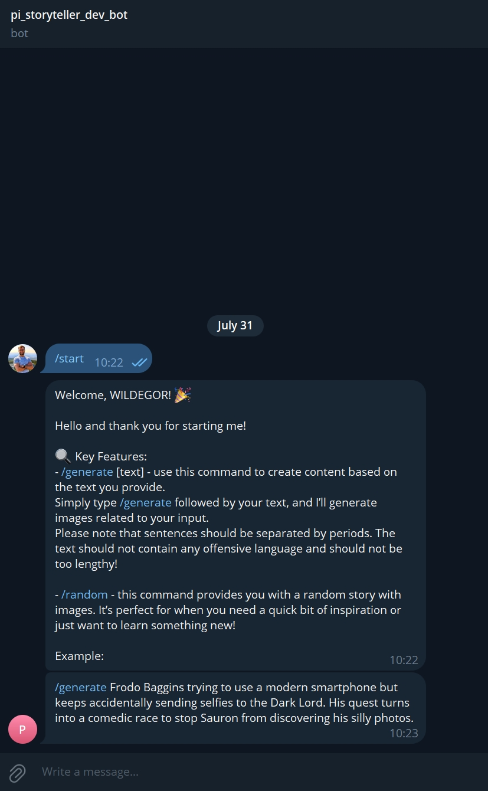
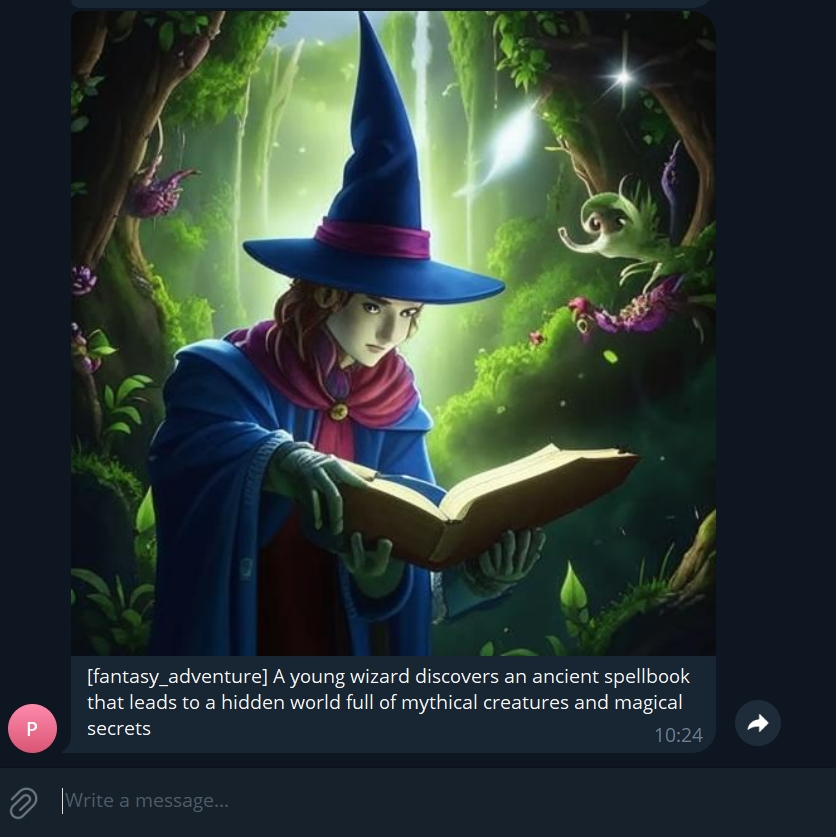
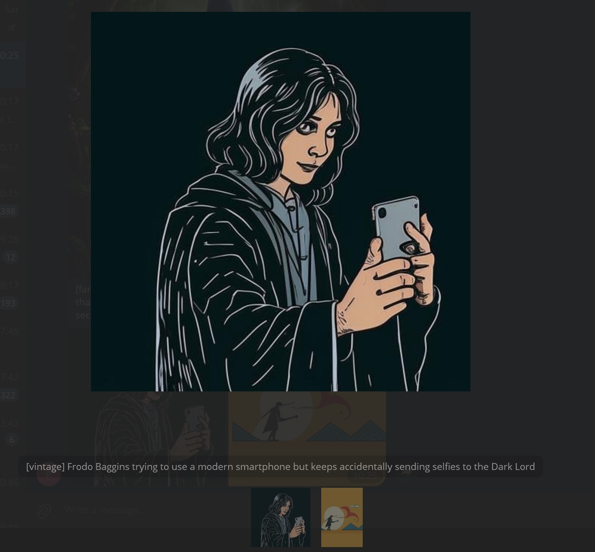
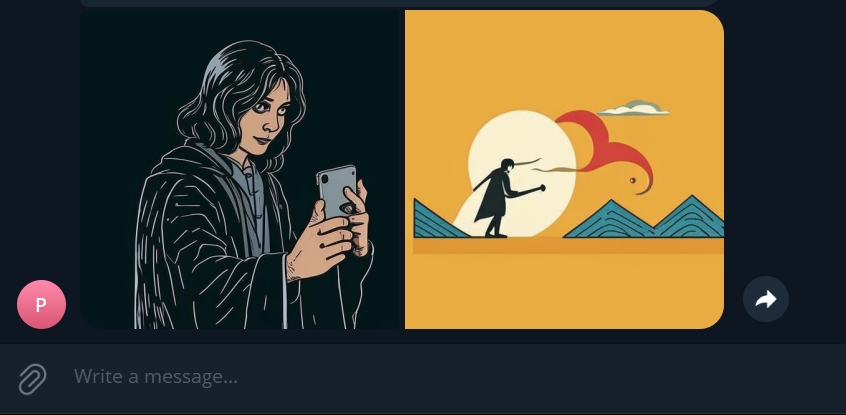
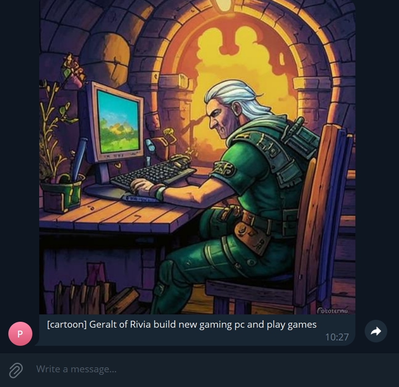

## Idea

I recently acquired a single-board computer (SBC) - BPI-M2 Zero. It is a cheap alternative to the Raspberry Pi but overall just as capable. It is a computer (Linux-based) about the size of a credit card! The main difference from mini-PCs is that the board is not particularly customizable in terms of hardware. Besides specific Linux distributions, you can also install, for example, older versions of Android. Another notable feature is the IO interfaces, which can be used to control and gather data. The first project I want to run on this computer is a web server written in Go. Plus, I enjoy practicing, and it seemed like a good idea to combine the two.

Many of us have probably seen the animated movie Shrek. If you remember, the movie begins with a short story in the form of a book with a voice-over. My idea is to "feed" short stories (for example, about the gingerbread man) and generate a slideshow of images in different styles. It is not necessary to use fairy tales; for example, the author in the links below used news headlines and memes. The sources of inspiration for me were this and this projects. In the first case, image generation is done using the BPI-M2 Zero. On average, it takes up to 30 minutes to generate a coherent image. In comparison, on my work computer, this process takes up to 20 seconds. I will provide more detailed comparisons below. It is clear for now that generating images "on the spot" is possible but not particularly practical. Therefore, it was decided to write an "adapter" that would help substitute different sources for obtaining images. As a result, a relatively small service was written, which will be discussed below.

## About "StoryTeller"

The overall architecture of the service looks like this:



The service includes the following modules:
- **Bot**: An abstraction that listens for commands from "Users".
- **Telegram Adapter**: A wrapper around the Telegram API to listen for bot commands and send messages.
- **Imaginator**: An abstraction that provides an API for generating images from text.
- **KandinskyAdapter**: A wrapper around the REST API of the Kandinsky service, which allows for image generation from text.
- **Textor**: An abstraction that provides an API for creating "Stories".
- **ChatGPT Adapter**: A wrapper around the REST API client for the Chat GPT service. Not in use, but available.
- **Router**: A wrapper that directs calls to the appropriate "Handler"-s.
- **Handler**: A use case script, such as bot commands.
- **Configurator**: Parses and updates the service configurations.
- **Dispatcher**: A service that allows specific "Job"-s to be executed asynchronously based on queues.
- **Job**: A wrapper that holds information about the executable function.
- **Templater**: A service that transforms structures into .html files. Not in use, but intended to combine text with images in the future.
- **Prompter**: A service that prepares a text request from a dictionary.
- **Cronus**: A service that runs cronjobs. For example, it parses news headlines from RSS every hour, generates an image, and sends it to the chat.

Key functionalities:
- Generating a series of images based on bot commands.
- Generating a random image.
- Parsing news from the last hour and generating a cover image.
- Limiting simultaneous image generation, both as a parallel process and requests among "Users" (priority-based queues).
- Displaying real-time metrics.

## Prepare BPI-M2 Zero

### Custom image

Using custom Armbian image created with [video](https://www.youtube.com/watch?v=kQcEFsXEJEE). First, on Window machine run WSL. If you don't familiar with WSL [install guide](https://learn.microsoft.com/en-us/windows/wsl/install). The process is quite intuitive because it is done through a CLI utility with a user-friendly GUI. It is important to choose the right platform and distribution. I chose Ubuntu 22.04 Jammy without a graphical interface and the Banana Pi M2 Zero platform. The next step will be to write the resulting image to a flash drive and boot from the board. This is not difficult and is also explained in the video above. The network setup process seemed rather strange to me.

### Setting up on board WI-FI

Folow this [instructions](https://wiki.banana-pi.org/Getting_Started_with_M2_Zero#WiFi_Client). But more suitable [comment](https://forum.armbian.com/topic/5610-wifi-on-bpi-m2-plus/?do=findComment&comment=43238). After setting up Banana board will be automatically connected to provided network (using SSID and password).

Чтобы проверить, что все работает корректно, можно произвести следующие простые действия:
Проверить, если доступ до гугловского DNS:
```shell
ping 8.8.8.8
```

Check internet connectivity:
```shell
sudo apt-get install -y speedtest-cli
speedtest-cli --secure
```

In my case I got this output:


## Deploy

[Here](https://github.com/WildEgor/pi-storyteller/blob/develop/scripts/releaser.sh) I prepared a simple script that should help deploy the service. It downloads the necessary packages and the latest release from GitHub. It deploys the unit and updates it with the latest release. Simply place this script in the project directory. In my case, this is the /app folder at the root, and then run it.

```shell
chmod +x /app/releaser.sh
/app/release.sh
```



If everything went successfully, you should see the following output:

## Results

There are some examples of how it's working.

Use `/start` command to get started and some information about the service:


Use `/random` to get a random image:


Use `/generate` with your prompt to generate a image(s). For example, Frodo using smartphone:



or Geralt found a gaming computer:


## Links:
- [https://github.com/WildEgor/pi-storyteller](https://github.com/WildEgor/pi-storyteller) - source code;
- [https://www.youtube.com/watch?v=kQcEFsXEJEE](https://www.youtube.com/watch?v=kQcEFsXEJEE) - guide how create armbian image;
- [https://learn.microsoft.com/en-us/windows/wsl/install](https://learn.microsoft.com/en-us/windows/wsl/install) - WSL guide;
- [https://wiki.banana-pi.org/Getting_Started_with_M2_Zero#WiFi_Client](https://wiki.banana-pi.org/Getting_Started_with_M2_Zero#WiFi_Client) - BPI-M2 Zero WI-FI settings;
- [https://forum.armbian.com/topic/5610-wifi-on-bpi-m2-plus/?do=findComment&comment=43238](https://forum.armbian.com/topic/5610-wifi-on-bpi-m2-plus/?do=findComment&comment=43238) - comment about BPI-M2 Zero WI-FI troubles.